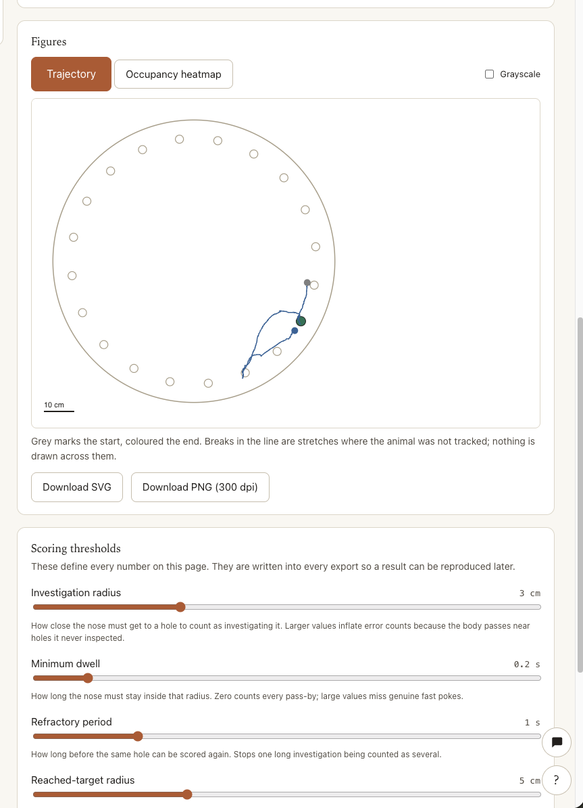
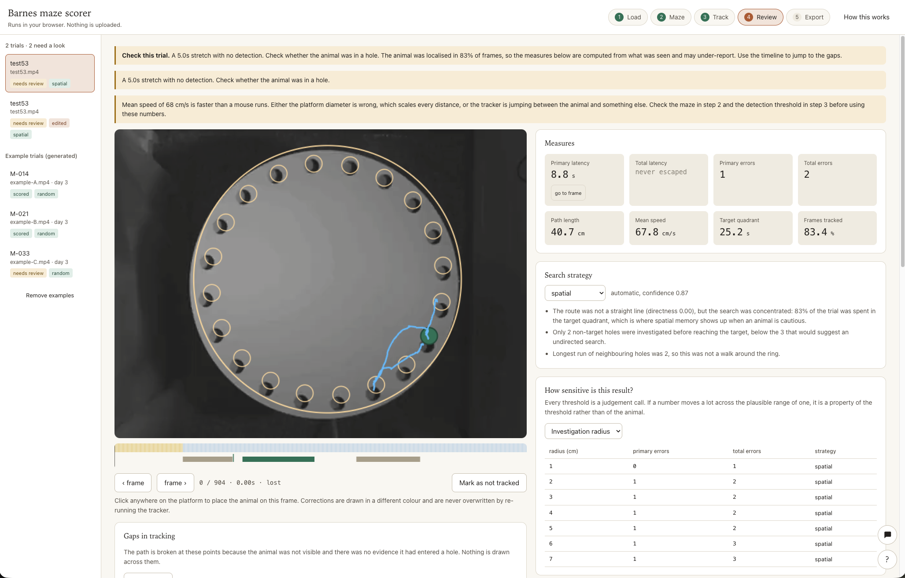

# Barnes maze scorer

**[Live app](https://barnes-maze-lab.vercel.app/) &middot; [Demo video**](VIDEO URL)

A browser tool that turns Barnes maze videos into an analysis-ready spreadsheet, built for a
researcher who wants results without opening a terminal. Track the animal, define the maze,
review and correct, and export tidy data with publication figures. It runs fully client-side,
so videos never leave the machine.






## Quick start

```bash
git clone https://github.com/NileshArnaiya/novel-barnes-maze-lab
cd novel-barnes-maze-lab-main
pnpm install
pnpm dev
```

Open the printed localhost URL. Node 18+ and [pnpm](https://pnpm.io) 9+.

Sample data ships with the repo under barnes-maze-data or you can Grab the three test clips from [salk-airc/rse-takehome-2026](https://github.com/salk-airc/rse-takehome-2026) under
`data/barnes-maze/`, or click **Load example trials** in the app for three generated ones.

## Scripts


| Command          | What it does                                               |
| ---------------- | ---------------------------------------------------------- |
| `pnpm dev`       | Start the dev server with hot reload                       |
| `pnpm build`     | Type-check and build a static `dist/`                      |
| `pnpm preview`   | Serve the built `dist/` locally                            |
| `pnpm test`      | Golden tests on synthetic trajectories                     |
| `pnpm test:eval` | Detection and tracking-accuracy checks on the sample clips |
| `pnpm typecheck` | `tsc --noEmit`                                             |


## How it works

Five steps, left to right:

1. **Load** &mdash; drop in an MP4, or a SLEAP / DeepLabCut CSV export (auto-detected).
2. **Maze** &mdash; drag a ring onto the platform, size it, mark the escape hole. Do it once,
  then apply the geometry to the rest of the cohort.
3. **Track** &mdash; find the animal frame by frame, or re-reason over an imported track.
4. **Review** &mdash; the workspace: trajectory over the footage, a scrubable timeline,
  live-updating measures, the strategy classifier with its reasoning, and every threshold
   on screen next to the numbers it drives.
5. **Export** &mdash; the cohort learning curve, an analysis-ready Excel workbook, tidy CSVs,
  trajectory and heatmap figures, and a reloadable project file.

The design rule the whole thing follows: **uncertainty is never hidden.** When the animal
can't be located, the frame is marked lost and drawn as a break in the path, never
interpolated. A hole entry and a tracking failure are distinct states, resolved from where
the animal was last seen. Every number links back to the frame it came from.

## What I chose not to build

- **A trained strategy classifier.** BUNS (Illouz 2016) is the rigorous version, an SVM over trajectory features. A model shipped without its training set is a black box the user can't audit, so I used transparent rules over the same features, with the reasoning shown.
- **A deep-learning tracker.** More robust on hard footage, but an unauditable dependency that
needs a download. The classical tracker can be explained in two minutes and fails visibly;
for hard footage the SLEAP/DeepLabCut import path takes over.
- **A backend or desktop build.** I was in 2 minds, because a backend could help in many ways to use APIs and databases to store locally and also run models locally or hosted which would help but eventually a web interface is the most easiest way to get a researcher to try the tool out. 
- **Native** `.slp` **/** `.h5` **parsing.** Both are HDF5, a heavy browser dependency. Labs share the  
CSV exports, so did not make sense to do this, might add only for convenience in the future. 


## Tech

TypeScript, React, and Vite. No backend and no runtime data services. Video is decoded with
WebCodecs (frame-exact) or the `<video>` element as a fallback; the demuxer is `mp4box` and
the Excel export uses `SheetJS`, both bundled and lazy-loaded. Deploys as static files to any
host; a `vercel.json` is included.

The scientific core in `src/core/` is pure TypeScript with no dependencies and no DOM, so
every measure is unit-testable in isolation. React is only the shell around it.

```
src/
  core/       measures, events, strategy, geometry  (pure, tested)
  tracking/   background model, blob detection, occlusion, decoding
  io/         persistence, CSV/XLSX export, pose import, figures
  state/      the project store
  ui/         wizard shell, steps, canvas, panels
```


## Testing

`pnpm test` checks the measures against synthetic trajectories with answers worked out by
hand. `pnpm test:eval` runs the real detectors on frames from the sample clips and, if you've
hand-labelled a few frames with `scripts/label-frames.mjs`, checks the tracked point lands on
the animal. Both eval layers skip cleanly and print setup instructions when the sample data
isn't present, so CI stays green without it. See `[docs/validation.md](docs/validation.md)`
for what tracking accuracy was and wasn't validated against.

## Privacy and cost

Nothing is sent anywhere: no server, API key, analytics, cookie, or CDN. The one exception is
an optional trial explainer (step 4) that calls Google Gemini, off unless
`VITE_GEMINI_API_KEY` is set, and even then it sends only summary numbers, never frames or
identifiers, and shows the exact payload first. See `[.env.example](.env.example)`. Running
cost is static hosting only; the analysis happens in the browser.

## Accessibility

Keyboard-navigable throughout (press `?` for the shortcut list), a skip link to the
workspace, status never signalled by colour alone, a real `slider` timeline, reflow at 200%
zoom, and `prefers-reduced-motion` honoured.

## Docs

- `[docs/measures.md](docs/measures.md)` &mdash; every measure, its source, and where the
literature disagrees.
- `[docs/validation.md](docs/validation.md)` &mdash; how tracking accuracy was checked.
- `[ARCHITECTURE.md](ARCHITECTURE.md)` &mdash; data flow in one page.
- `[CONTRIBUTING.md](CONTRIBUTING.md)` &mdash; local setup and the rules for a change.
- `[KNOWN_LIMITATIONS.md](KNOWN_LIMITATIONS.md)` &mdash; real defects vs excluded scope.
- `[AI_NOTES.md](AI_NOTES.md)` &mdash; how AI tooling was used and where it was wrong.


## Claude skill

The installable Claude Code skill lives at
[NileshArnaiya/barnes-maze-claude-skill](https://github.com/NileshArnaiya/barnes-maze-claude-skill).
It teaches Claude this assay's measures, the export schema, and the analysis traps the data
invites, so it writes correct analysis code against the exports. A copy also ships in
`[claude-skills/](claude-skills/)`.

```
/plugin marketplace add NileshArnaiya/barnes-maze-claude-skill
/plugin install analyzing-barnes-maze@barnes-maze-skills
```


## License

[MIT](LICENSE).