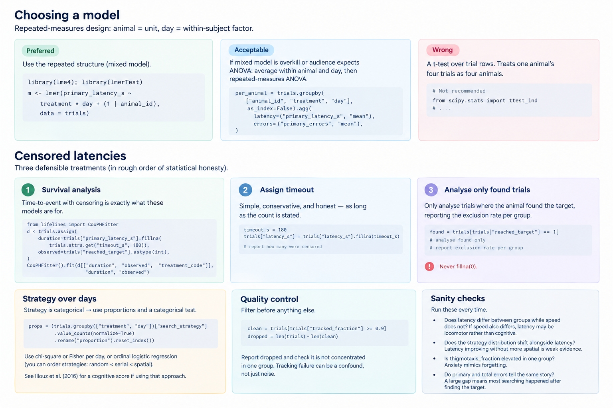

# Choosing a model



Used ChatGPT for this visual after multiple iterations, for ease of understanding.

The question is almost always "did group A learn faster than group B"

**Preferred**, because it uses the repeated structure rather than discarding it:

```r
library(lme4); library(lmerTest)
m <- lmer(primary_latency_s ~ treatment * day + (1 | animal_id), data = trials)
```

## Censored latencies

1. **Survival analysis.** Time-to-event with censoring is exactly what these models are
   for, and this literature under-uses them.

   ```python
   from lifelines import CoxPHFitter
   d = trials.assign(
       duration=trials["primary_latency_s"].fillna(trials.attrs.get("timeout_s", 180)),
       observed=trials["reached_target"].astype(int),
   )
   CoxPHFitter().fit(d[["duration", "observed", "treatment_code"]], "duration", "observed")
   ```

2. **Assign the timeout and report how many trials were censored.** Simple, conservative,
   and honest as long as the count is stated.

3. **Analyse only trials where the animal found the target**, reporting the exclusion rate
   per group. Acceptable only if the rate is similar between groups; if it is not, the
   exclusion itself is the result.


## Strategy over days

Strategy is categorical, so it needs proportions and a categorical test.
```

A chi-square or Fisher test per day, or ordinal logistic regression if you are willing to
order the strategies (random < serial < spatial), which many papers do. Illouz et al. (2016)
propose a cognitive score that collapses strategy into a single ordinal value.
```


## Quality control before anything else


```python
clean = trials[trials["tracked_fraction"] >= 0.9]
dropped = len(trials) - len(clean)
```

Report `dropped` and check it is not concentrated in one group. Tracking that fails
systematically in one condition.